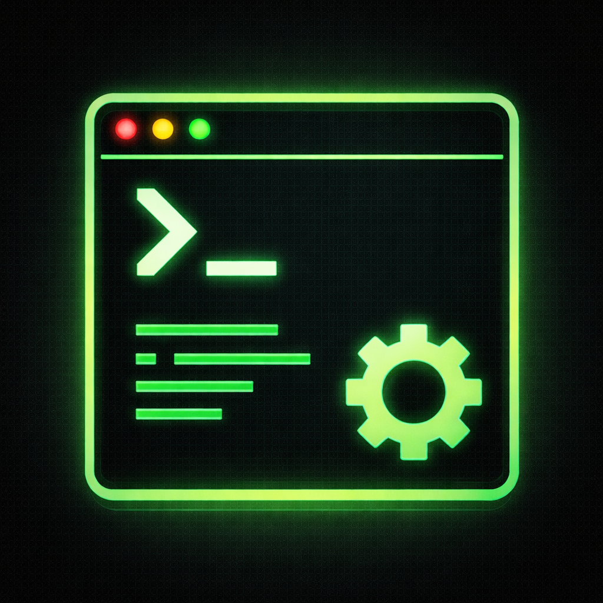

<!-- repo[impl readme.explanation] -->
<!-- repo[impl readme.identity] -->
# Teamy Studio

Teamy Studio is a Windows-first desktop shell initialized from the shared Rust CLI scaffold and tuned for an application-first launch path.

Running `teamy-studio.exe` with no command-line arguments opens a translucent terminal window centered on screen. The window hosts a shell inside a PTY, renders terminal content through `libghostty-vt`, and can be repositioned by dragging the top accent strip.

<!-- repo[impl readme.media-demo] -->


## Current Behavior

- no arguments launches the desktop terminal window
- `shell` launches the configured default shell inline in the current console
- `shell default set <program> [args...]` persists the default shell command in the Teamy Studio home directory
- `shell default show` prints the effective default shell command
- `window show` launches the same terminal window explicitly
- `--help` and `--version` still work through the shared figue CLI plumbing
- structured logging can still be written to stderr and optional NDJSON files
- on Windows, bare shell names such as `pwsh` are resolved through `PATH` and `PATHEXT` before the PTY-backed window launches them

<!-- repo[impl readme.code-example] -->
## Example Usage

Launch the application:

```powershell
cargo run --
```

Launch the window explicitly through the CLI surface:

```powershell
cargo run -- window show
```

Persist PowerShell as the default shell and show the effective value:

```powershell
cargo run -- shell default set -- pwsh.exe -NoLogo
cargo run -- shell default show
```

Launch the configured default shell inline:

```powershell
cargo run -- shell
```

Inspect the CLI surface:

```powershell
cargo run -- --help
```

Write structured logs to disk while launching the app:

```powershell
cargo run -- --log-file .\logs window show
```

## Environment Variables

- `TEAMY_STUDIO_HOME_DIR`: overrides the resolved application home directory
- `TEAMY_STUDIO_CACHE_DIR`: overrides the resolved cache directory
- `RUST_LOG`: provides a tracing filter when `--log-filter` is not supplied

The home directory now stores the persisted default shell command in a simple text file. The cache directory remains scaffolded for later product work.

## Quality Gate

Run the standard validation flow with:

```powershell
./check-all.ps1
```

That script runs formatting, clippy, build, tests, and local tracey validation.

For Tracy profiling, run:

```powershell
./run-profiler.ps1 window show
```

For an unattended live Timeline Playground run that also writes an FPS report, use:

```powershell
./run-profiler.ps1 self-test timeline-live-view
```

Add `--overlay-message` if you want the self-test window to explain that it is non-interactive while automation is running:

```powershell
./run-profiler.ps1 self-test timeline-live-view --overlay-message "AI self-test running; window is non-interactive"
```

To reproduce the long-run zoomed-out regression without opening the Tracy UI, use fit-content mode together with interval buckets and the headless profiler switch:

```powershell
./run-profiler.ps1 -NoOpenProfiler self-test timeline-live-view --sample-ms 30000 --bucket-ms 5000 --viewport-mode fit-content --fit-content-interval-ms 5000 --minimum-visible-pixels 4 --overlay-message "AI self-test running; window is non-interactive" --fail-below-fps 15
```

The JSON report includes aggregate frame stats plus `summary.worst_frame_ms` and `samples[].slowest_frames[]` so unattended runs can point directly at the most expensive frame ranges.

That wrapper defaults to the debug profile so captures can show the same lag you see from `cargo run`. Pass `-Release` to use the dedicated Cargo `profiling` profile:

```powershell
./run-profiler.ps1 -Release window show
```

If you want to prewarm release profiling artifacts before a release capture, run `cargo build --profile profiling`.

<!-- repo[impl implementation.present] -->
## Repository Layout

```text
. # Some files omitted
├── .config/tracey/config.styx # Local tracey specification wiring
├── build.rs # Adds exe resources and embeds git revision
├── Cargo.toml # Package metadata and dependency wiring
├── docs/spec # Human-readable requirements for the repository and CLI
├── resources # Windows resources used by build.rs
├── src/app # Application startup and Win32 window logic
├── src/cli # CLI parsing and explicit commands
├── src/paths # Shared path resolution scaffolding kept for later work
└── tests # CLI roundtrip fuzz tests
```
